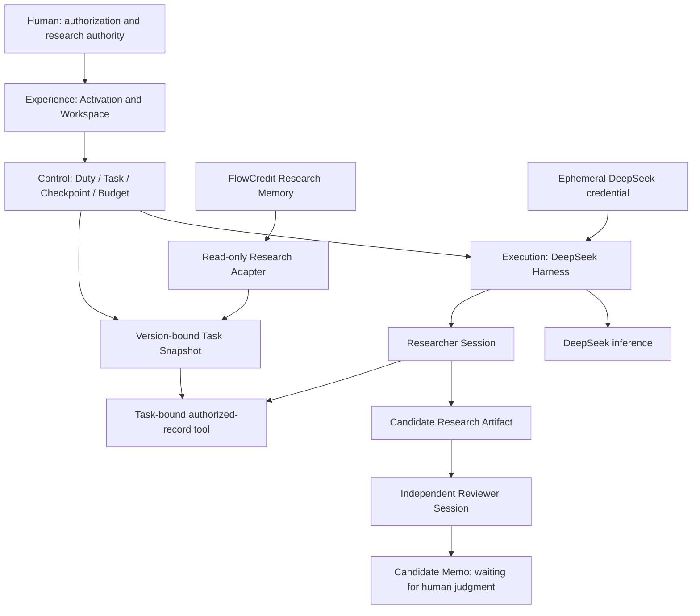

# Platform architecture

The coordinator is programmatic. Only Researcher and Reviewer are instantiated; no planner model, router agent, monitor agent, or chat transcript bus is present. Each invocation has a fresh Session. Artifacts are the exchange boundary.

## Two state systems

**Execution state**: `RESEARCH_PENDING → RESEARCH_RUNNING → REVIEW_PENDING → REVIEW_RUNNING → MEMO_PENDING → MEMO_READY`. Cancellation or incomplete execution preserves a reason and stops. Invalid context enters `RECOVERY_BLOCKED`; a non-PASS review enters `NEEDS_ATTENTION`. Resume skips committed work.

**Research authority state** belongs to FlowCredit and people. Evidence Admission, Claim Revision, Relation and Human Decision are never effects of an Agent run. The fixture setup and explicit synthetic v2 administration action are separate from live execution.

- Agent COMPLETE ≠ Research Accepted.
- Reviewer PASS ≠ Human Approval.
- Model Session ≠ Duty.
- Harness Session ≠ Research Memory.

## Persistence and binding

Control SQLite retains the H2/H3 data model: Duty JSON; Task immutable context/digest/state/Checkpoint; independent AgentRun; Artifact with task/producer/digest; Snapshot; BudgetLedger; LifecycleEvent. Unresolved issues live in Checkpoint. Artifact, successful Run and Checkpoint advance in one transaction. Exports are inspection copies, not recovery authority.

Snapshot includes Task, subject, Claim and exact base revision, permitted record/source/evidence identities, as-of time, adapter version, source text, admission state and canonical digest. The real Core uses subjectId rather than a separate research-object table. E binds S1/v1; F explicitly binds S2/v2. A task cannot switch to latest or select another snapshot through a tool parameter.

The adapter opens both synthetic Memory and Retrieval read-only, pins their read views in one synchronous transaction and invokes the actual Core read APIs through a read-only backend facade. The synthetic fixture has no concurrent external writer. This does not establish distributed snapshot isolation for a future production deployment.

## Runtime API

All endpoints are local to the loopback host, reject incorrect Host/Origin, and use JSON for mutations.

| Endpoint | Behavior |
| --- | --- |
| `GET /api/state` | Work, bindings, candidate artifacts and capability status; no credential |
| `POST /api/activate` | Install `{key}` in RAM; no connectivity model call |
| `POST /api/create-e` | Create S1/v1 and E; repeated creation refused |
| `POST /api/test-v2` | Explicit synthetic-only administrative revision event |
| `POST /api/create-f` | Create S2/v2 and F after E is ready |
| `POST /api/resume` | Resume `{taskId}` deterministically after integrity checks |
| `POST /api/stand-down` | Cancel/drain execution, release Sessions and credential |
| `POST /api/secret-check` | Exact-match check against the active credential in the runtime data directory; returns counts only |

Experience states are Dormant, transient Activating, and Swarm Online / capability ready. Provider validity remains unverified until an actual request; no fake successful inference is reported.

## Creation UI seam

The earlier Creation animation is a mock lifecycle with an embedded simulated Workspace and additional visual roles. P0 deliberately retains the functional research UI. A future visual shell should submit to `/api/activate`, animate only the pending state, render returned capability status, show the same `/api/state` Workspace, and call `/api/stand-down` on cancellation. An animation-complete callback must never create backend success.

## Dependency acquisition

Harness uses exact official npm versions; the full peer closure is pinned to prevent an alpha dependency from silently pulling a newer RC. Core uses a public commit/archive checksum because upstream lacks a root package manifest. Only domain directories and required validation metadata are extracted into an ignored dependency directory. No developer machine checkout is a dependency.
