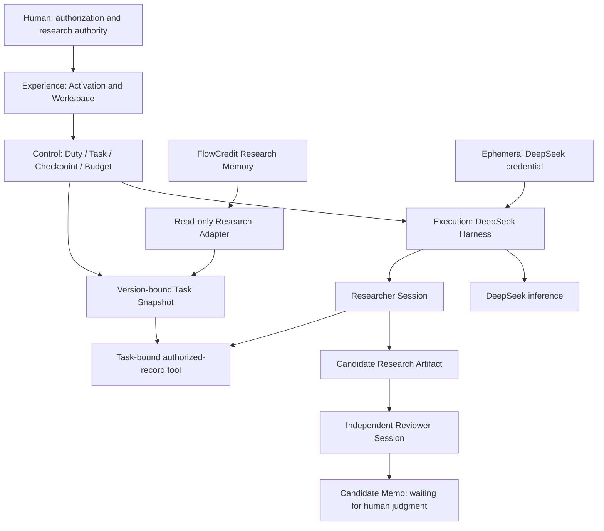

# Platform architecture

For the 0.2 AgentWork integration (native Harness plus a tool-free Claude Code Reviewer), separate delegation budgets, comparison artifacts and local lifecycle, see [local platform](local-platform.md). The diagram below describes the native reference path.

The coordinator is programmatic. Each role invocation creates an ephemeral parent Agent handle that receives no model task, then delegates through the official Harness `spawn` provider. Only Researcher and Reviewer perform inference. Each child has a fresh Session with no inherited conversation; artifacts are the exchange boundary. Child and parent are disposed before returning the result. See [native collaboration](harness-collaboration.md) for lifecycle receipts and migration limits.

## Two state systems

**Execution state**: `RESEARCH_PENDING → RESEARCH_RUNNING → REVIEW_PENDING → REVIEW_RUNNING → MEMO_PENDING → MEMO_READY`. Cancellation or incomplete execution preserves a reason and stops. Invalid context enters `RECOVERY_BLOCKED`; a non-PASS review enters `NEEDS_ATTENTION`; an explicit human exit enters `ABANDONED`. Resume skips committed work, and the checkpoint keeps the failure code distinct from later integrity or teardown handling.

**Repair loop**: a `REQUEST_REVISION` review never mutates the original Task back into `RESEARCH_PENDING`. It preserves the original Task, Research Artifact and Review Artifact and opens an explicit Repair Task whose lineage records `parentTaskId`, `snapshotId`, `snapshotOwnerId`, `contextDigest`, `inputArtifactId`, `reviewArtifactId` and `reason`. Creation is zero-cost and dispatches nothing: the shell waits for the explicit public action `START_REPAIR` (the idempotent creation helper stays internal to `POST /api/create-repair` for `BLOCKED` and explicit authorization). A Repair Task has no Snapshot of its own, and before every dispatch it must re-prove that `snapshotId`, `snapshotOwnerId` and `contextDigest` still match the chain root's frozen Snapshot and context, so context cannot silently expand and no `latest` revision is reachable; a tampered binding fails with `REPAIR_BINDING` before any model transport. Starting it creates a new Researcher AgentRun, checks budget before dispatch, and produces a new Research Artifact carrying `supersedesArtifactId` lineage. The revision is reviewed through the same Reviewer mechanism; PASS assembles a Candidate Memo that stops at the Human Gate. `BLOCKED` and execution failures never create a repair automatically and never retry: deterministic human exits are `CREATE_REPAIR_TASK` (only when no shell exists and a non-PASS Review does) and `ABANDON_TASK`. While a Task has a non-terminal child Repair Task, `ABANDON_TASK` on the parent rejects with `ACTIVE_CHILD_TASK_EXISTS` — no cascade and no silently abandoned child; the waiting shell itself may be started or abandoned. Reviewer `issues[].recordIds` is validated against the Task's authorized Snapshot scope for both providers; any out-of-scope record rejects the whole Review Artifact with `REVIEW_RECORD_OUT_OF_SCOPE` before commit. A cross-provider comparison requires a provider different from the recorded Reviewer; same-provider work is rejected or explicitly stored and labelled as a repeat review.

**Research authority state** belongs to FlowCredit and people. Evidence Admission, Claim Revision, Relation and Human Decision are never effects of an Agent run. The fixture setup and explicit synthetic v2 administration action are separate from live execution.

- Agent COMPLETE ≠ Research Accepted.
- Reviewer PASS ≠ Human Approval.
- Model Session ≠ Duty.
- Harness Session ≠ Research Memory.

## Persistence and binding

Control SQLite retains the H2/H3 data model: Duty JSON; Task immutable context/digest/state/Checkpoint; independent AgentRun; Artifact with task/producer/digest; Snapshot; BudgetLedger; LifecycleEvent. Unresolved issues live in Checkpoint. Artifact, successful Run and Checkpoint advance in one transaction. Exports are inspection copies, not recovery authority.

Snapshot includes Task, subject, Claim and exact base revision, permitted record/source/evidence identities, as-of time, adapter version, source text, admission state and canonical digest. The real Core uses subjectId rather than a separate research-object table. E binds S1/v1; F explicitly binds S2/v2. A task cannot switch to latest or select another snapshot through a tool parameter.

The adapter opens both synthetic Memory and Retrieval read-only, pins their read views in one synchronous transaction and invokes the actual Core read APIs through a read-only backend facade. The synthetic fixture has no concurrent external writer. This does not establish distributed snapshot isolation for a future production deployment.

## Runtime API

All endpoints bind to the loopback host and reject incorrect Host. Mutations additionally require the same Origin and JSON.

| Endpoint | Behavior |
| --- | --- |
| `GET /api/memory` | Human read-only browsing of the current synthetic Claim and four allowlisted records; no task creation |
| `GET /api/state` | Work, bindings, candidate artifacts and capability status; no credential |
| `POST /api/activate` | Install `{key}` in RAM; no connectivity model call |
| `POST /api/create-e` | Create S1/v1 and E; repeated creation refused |
| `POST /api/test-v2` | Explicit synthetic-only administrative revision event |
| `POST /api/create-f` | Create S2/v2 and F after E is ready |
| `POST /api/resume` | Resume `{taskId}` deterministically after integrity checks; accepts research and repair tasks |
| `POST /api/start-repair` | Start the existing Repair Task shell of `{taskId}`; never creates a second task and never cascades |
| `POST /api/create-repair` | Explicitly open a Repair Task for a non-PASS task; idempotent per Review, never executes it |
| `POST /api/abandon` | Explicit human exit for `NEEDS_ATTENTION` / `RECOVERY_BLOCKED` or a waiting Repair Task; rejects `ACTIVE_CHILD_TASK_EXISTS` while a non-terminal child Repair Task exists; keeps artifacts, spends no budget |
| `POST /api/stand-down` | Cancel/drain execution, release Sessions and credential |
| `POST /api/secret-check` | Exact-match check against the active credential in the runtime data directory; returns counts only |

Experience states are Dormant, transient Activating, and Swarm Online / capability ready. Provider validity remains unverified until an actual request; no fake successful inference is reported.

## Creation activation entry

The default `/` entry is the Creation fingertip scene. The artwork crop, material
transition and restrained wave are local Canvas rendering. There is no iframe,
embedded mock workspace or second execution engine. The same document routes into
the real workspace after `POST /api/activate` acknowledges the temporary capability.
The animation waits for that acknowledgement; its own clock cannot create success.
Providing a key does not dispatch work or validate it with a paid model call.

Only Researcher and Reviewer perform inference. Internal parent handles own delegation
lifecycles without reasoning. Control, Harness and Memory in the visual network
represent existing modules, not additional model roles or fabricated running jobs.
The scene suspends drawing in the workspace and in hidden tabs; reduced motion skips
the flash and wave. Offline reading is available directly from the homepage.

Cancel invalidates visual completion and waits for any pending activation response
before sending Stand Down, so a delayed activation cannot follow cancellation and
re-enable capability. Reload and reconnect use the actual runtime state; stopping
retains research and removes the key. Input is cleared on submission and when leaving
the homepage. Reconnecting from a workspace page returns to that page.

## Dependency acquisition

Harness uses exact official npm versions; the full peer closure is pinned to prevent an alpha dependency from silently pulling a newer RC. Core uses a public commit/archive checksum because upstream lacks a root package manifest. Only domain directories and required validation metadata are extracted into an ignored dependency directory. No developer machine checkout is a dependency.

## Unified workspace

The platform has one web entry and one runtime. Research overview, task collaboration,
read-only memory and execution history share the same live Control Plane state.
Activation happens on the Creation homepage; a workspace dialog controls capability status and Stand Down. Providing a key does not dispatch work.
Users explicitly start a bound task. Researcher output, Reviewer feedback, unresolved
questions and the final candidate memo appear together, with citations opening the
**task's fixed snapshot**, not the current memory revision.

`GET /api/memory` exposes the four allowlisted synthetic records and the explicitly
labelled current Claim revision through the actual read-only Core adapter. It creates
no Task, writes no Snapshot and grants no Agent permissions. No credential is needed
for human browsing. This human browsing projection is distinct from the immutable
Agent task snapshot. Production memory selection is not implemented.

The UI derives action availability from task state, revision availability, runtime
activity and remaining budget; server checks remain authoritative. Stand Down stays
available during a long request. Client response sequencing prevents an older request
from overwriting a newer stop notice. Runtime generation checks isolate late model
responses, including provider-validation status. Interrupted or blocked tasks show
reasons rather than offering an unsafe repeat action.

The Creation scene and the unified workspace share the same backend capability and
Control Plane. Historical mock workspaces and additional simulated agents are not imported.

## Public Pages deployment is a separate execution mode

The five-plane architecture above describes the local platform. GitHub Pages runs
only the web presentation and a browser-memory simulator; it does not host Node,
SQLite, Harness or the DeepSeek adapter. The build replaces the transport and
activation handler in the generated artifact, removes credential input, and adds a
persistent simulation label. The original local web/runtime sources retain the real
activation path.

`apps/pages/demo-runtime.js` supplies preset research/review results and bounded,
cancelable state transitions. `scripts/build-pages.mjs` exports only allowlisted web
assets and newly seeded synthetic snapshots into ignored `.pages/`. It never reads
local runtime history. CSP blocks network connections and form submissions. Refresh
or reset clears demo state; it does not provide hard-restart recovery.

The Pages workflow tests and publishes that static artifact. The offline workflow
checks the local platform using substituted model responses. Neither workflow calls
DeepSeek. Historical live H0–H3 evidence is documented separately in
[validated milestones](validated-milestones.md).
