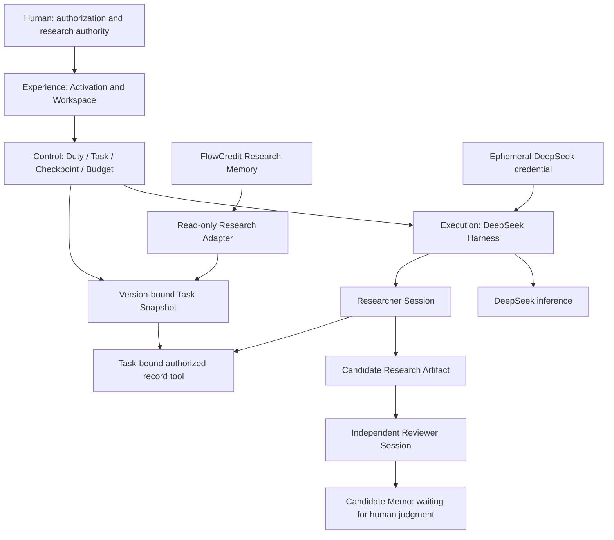

# Platform architecture

The coordinator is programmatic. Only Researcher and Reviewer are instantiated; no planner model, router agent, monitor agent, or chat transcript bus is present. Each invocation has a fresh Session. Artifacts are the exchange boundary.

## Two state systems

**Execution state**: `RESEARCH_PENDING → RESEARCH_RUNNING → REVIEW_PENDING → REVIEW_RUNNING → MEMO_PENDING → MEMO_READY`. Cancellation or incomplete execution preserves a reason and stops. Invalid context enters `RECOVERY_BLOCKED`; a non-PASS review enters `NEEDS_ATTENTION`. Resume skips committed work.

**Research authority state** belongs to FlowCredit and people. Evidence Admission, Claim Revision, Relation and Human Decision are never effects of an Agent run. The fixture setup and explicit synthetic v2 administration action are separate from live execution.

- Agent COMPLETE ≠ Research Accepted.
- Reviewer PASS ≠ Human Approval.
- Model Session ≠ Duty.
- Harness Session ≠ Research Memory.

## Persistence and binding

Control SQLite retains the H2/H3 data model: Duty JSON; Task immutable context/digest/state/Checkpoint; independent AgentRun; Artifact with task/producer/digest; Snapshot; BudgetLedger; LifecycleEvent. Unresolved issues live in Checkpoint. Artifact, successful Run and Checkpoint advance in one transaction. Exports are inspection copies, not recovery authority.

Snapshot includes Task, subject, Claim and exact base revision, permitted record/source/evidence identities, as-of time, adapter version, source text, admission state and canonical digest. The real Core uses subjectId rather than a separate research-object table. E binds S1/v1; F explicitly binds S2/v2. A task cannot switch to latest or select another snapshot through a tool parameter.

The adapter opens both synthetic Memory and Retrieval read-only, pins their read views in one synchronous transaction and invokes the actual Core read APIs through a read-only backend facade. The synthetic fixture has no concurrent external writer. This does not establish distributed snapshot isolation for a future production deployment.

## Runtime API

All endpoints are local to the loopback host, reject incorrect Host/Origin, and use JSON for mutations.

| Endpoint | Behavior |
| --- | --- |
| `GET /api/state` | Work, bindings, candidate artifacts and capability status; no credential |
| `POST /api/activate` | Install `{key}` in RAM; no connectivity model call |
| `POST /api/create-e` | Create S1/v1 and E; repeated creation refused |
| `POST /api/test-v2` | Explicit synthetic-only administrative revision event |
| `POST /api/create-f` | Create S2/v2 and F after E is ready |
| `POST /api/resume` | Resume `{taskId}` deterministically after integrity checks |
| `POST /api/stand-down` | Cancel/drain execution, release Sessions and credential |
| `POST /api/secret-check` | Exact-match check against the active credential in the runtime data directory; returns counts only |

Experience states are Dormant, transient Activating, and Swarm Online / capability ready. Provider validity remains unverified until an actual request; no fake successful inference is reported.

## Creation activation entry

The default `/` entry is the Creation fingertip scene. The artwork crop, material
transition and restrained wave are local Canvas rendering. There is no iframe,
embedded mock workspace or second execution engine. The same document routes into
the real workspace after `POST /api/activate` acknowledges the temporary capability.
The animation waits for that acknowledgement; its own clock cannot create success.
Providing a key does not dispatch work or validate it with a paid model call.

Only Researcher and Reviewer are agents. Control, Harness and Memory in the visual
network represent existing modules, not additional agents or fabricated running jobs.
The scene suspends drawing in the workspace and in hidden tabs; reduced motion skips
the flash and wave. Offline reading is available directly from the homepage.

Cancel invalidates visual completion and waits for any pending activation response
before sending Stand Down, so a delayed activation cannot follow cancellation and
re-enable capability. Reload and reconnect use the actual runtime state; stopping
retains research and removes the key. Input is cleared on submission and when leaving
the homepage. Reconnecting from a workspace page returns to that page.

## Dependency acquisition

Harness uses exact official npm versions; the full peer closure is pinned to prevent an alpha dependency from silently pulling a newer RC. Core uses a public commit/archive checksum because upstream lacks a root package manifest. Only domain directories and required validation metadata are extracted into an ignored dependency directory. No developer machine checkout is a dependency.

## Unified workspace

The platform has one web entry and one runtime. Research overview, task collaboration,
read-only memory and execution history share the same live Control Plane state.
Activation is a modal capability control; providing a key does not dispatch work.
Users explicitly start a bound task. Researcher output, Reviewer feedback, unresolved
questions and the final candidate memo appear together, with citations opening the
**task's fixed snapshot**, not the current memory revision.

`GET /api/memory` exposes the four allowlisted synthetic records and the explicitly
labelled current Claim revision through the actual read-only Core adapter. It creates
no Task, writes no Snapshot and grants no Agent permissions. No credential is needed
for human browsing. This human browsing projection is distinct from the immutable
Agent task snapshot. Production memory selection is not implemented.

The UI derives action availability from task state, revision availability, runtime
activity and remaining budget; server checks remain authoritative. Stand Down stays
available during a long request. Client response sequencing prevents an older request
from overwriting a newer stop notice. Runtime generation checks isolate late model
responses, including provider-validation status. Interrupted or blocked tasks show
reasons rather than offering an unsafe repeat action.

The Creation scene and the unified workspace share the same backend capability and
Control Plane. Historical mock workspaces and additional simulated agents are not imported.
