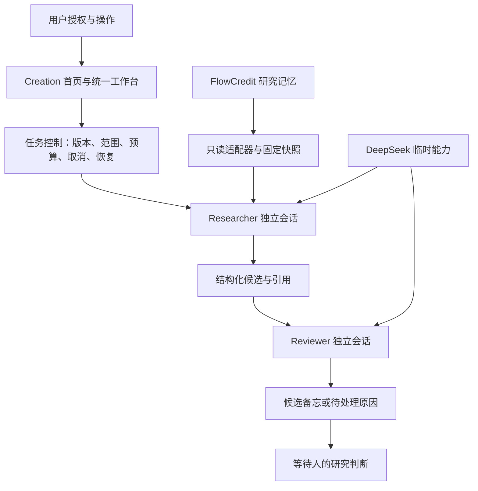

# 当前功能、架构与边界

本说明对应当前 main 的 H0–H3 平台整合、Creation 首页和公开 Pages 演示。它描述已经实现的能力，不是下一阶段的功能承诺。

## 产品做到哪一步

FlowCredit 已经能跑通一条有边界的研究协作流程：

**已有观点 → 固定授权资料与版本 → 主动开始研究 → Researcher 候选 → Reviewer 复核 → 候选备忘 → 等待人的判断。**

本地平台有真实执行和持久化基础；[公开页面](https://anhao1314.github.io/d/) 用于体验这条流程，所有模型结果都是预设模拟。当前没有持续自主工作的后台研究团队。

## 功能清单

| 模块 | 已实现行为 | 实际边界 |
| --- | --- | --- |
| Creation 首页 | 指尖局部、激活动画、取消、减少动效、进入工作台和返回原页面 | 本地动画等待后端接收 Key；首次研究请求才验证模型凭证。Pages 不收 Key |
| 研究概览 | 当前观点、待处理任务、候选备忘入口 | 当前研究对象固定为虚构 Northstar Compute |
| 研究记忆 | 浏览观点、证据、候选材料、文档与摘录定位 | 本地使用真实 Core，但数据是独立合成库；R-04 未接纳 |
| 任务协作 | E 固定 S1 / v1，F 固定 S2 / v2；保留截止时间、授权和摘要校验 | 不是通用任务创建器；已有任务不静默切换 latest |
| Researcher | 经受控工具读取授权原文，交付带引用和限制的结构化候选 | 不具备任意浏览器、文件、Shell 或数据库工具 |
| Reviewer | 独立会话消费候选产物与引用摘录，保留意见与限制 | PASS 不是人工批准；不通过时停止，当前无自动循环纠错 |
| 候选备忘 | 聚合观察、引用、限制和未解决问题 | 不自动接纳证据，不修订正式观点，不创建研究关系 |
| 停止与恢复 | 本地保留已提交状态，隔离迟到结果；重启不恢复 Key | 中断且结果／费用不确定的尝试需要检查，不保证任何中断都可直接续跑 |
| 执行记录 | 任务事件、会话、工具读取、预算账本与产物完整性检查 | 当前是本地运行记录，不是生产级集中监控 |

本地合成基线的总预算为六次模型请求。每个正常任务通常需要 Researcher 两次请求（包含工具后的续轮）和 Reviewer 一次请求。重复继续已完成任务不产生新请求；停止不会撤销已经发出的请求或费用。

## 系统框架

| 层 | 职责 | 实现位置 |
| --- | --- | --- |
| 体验层 | 激活首页、导航、候选结果、来源回链 | `apps/web`，HTML / CSS / JavaScript / Canvas |
| 控制层 | Duty、Task、AgentRun、Checkpoint、Artifact、预算与恢复 | `packages/control-plane`，Node.js + SQLite |
| 执行层 | 独立 Agent 会话与受控工具执行 | `packages/harness-adapter`，官方 DeepSeek Harness |
| 知识层 | 正式研究对象与固定版本只读上下文 | `packages/research-adapter`，公开固定版本 FlowCredit Core |
| 模型层 | 临时推理能力 | Harness 的 DeepSeek 适配器，Key 只在进程内存 |

只有 Researcher 和 Reviewer 执行模型推理。协调由程序负责：每一步创建不调用模型的父会话，通过 Harness 原生 spawn 委派独立子代理，并在结束后释放父子会话；首页中的 Control、Harness、Memory 表示模块，不是额外的模型角色。两个 Agent 通过产物与引用协作，不广播全部聊天历史，也不通过投票决定研究真相。

执行状态与研究权威分别保存：**任务完成 ≠ 研究接纳；Reviewer PASS ≠ 人工批准；模型会话 ≠ 长期研究记忆。** 当前没有从候选备忘到正式人工写回的产品流程。

原生委派的实现、验证和边界见 [Harness 协作迁移](harness-collaboration.md)。

## 验证与发布

- H0–H3 曾在独立实验中完成真实 DeepSeek 验证，范围见 [验证记录](validated-milestones.md)。这不是当前每次提交都重新进行了真实模型测试的声明。
- 默认测试使用真实 Core / Harness 与替代模型响应，覆盖整链路、权限、版本隔离、产物完整性、取消及真实进程重启。
- 首页测试检查后端确认前不能完成点亮、取消后不能迟到成功及减少动效行为。
- Pages 测试检查无 Key 输入、禁止网络连接、模拟研究、版本固定和取消隔离；GitHub Actions 自动构建发布。
- 页面与资源可公开分享；运行数据库、Key、会话记录与本机私有资料不进入仓库或 Pages 产物。

## 尚未实现

- 私人生产研究库选择、通用文件／资料导入与检索入口。
- 自由配置研究对象、资料范围及任意任务的产品流程。
- 新资料自动触发、事件收件箱、定时调度、持续驻场执行。
- 人工复核队列及批准后正式接纳证据、修订观点的写回流程。
- 多用户登录、团队权限、云端真实后端和生产级运维。

这些是后续方向，当前公开页面的可交互演示不代表它们已经实现。继续开发时，应优先补齐实际资料接入、可配置任务与人的正式接纳流程。
