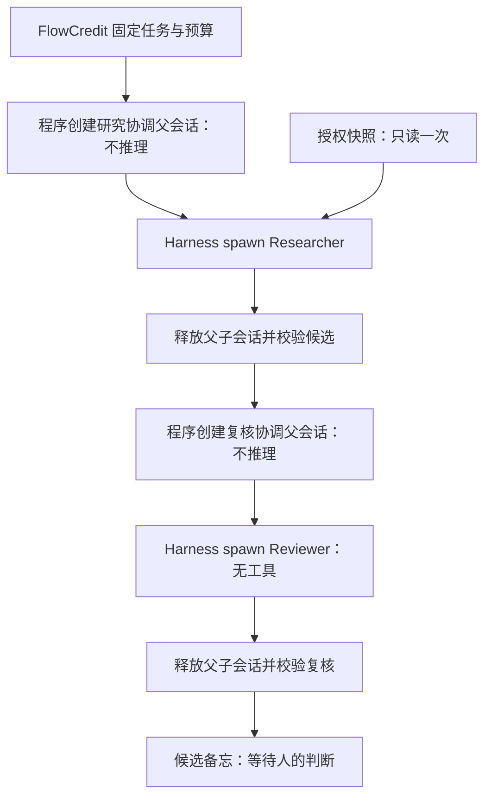

# Harness 原生协作迁移

本次将 Researcher / Reviewer 的默认执行路径迁移到官方 Harness 子代理服务。FlowCredit 仍负责任务、固定快照、授权范围、预算、候选产物与恢复；Harness 负责每一步的父子会话、执行、取消与释放。没有复制或修改 Harness 源码。

## 实际执行链

以前由 Runtime 直接创建 Agent、发送任务并等待空闲；现在由 `packages/harness-adapter/executor.mjs` 统一调用 `ctx.subagents.start("spawn", ...)`，等待 `child.result`，随后释放子会话、父会话和临时工具。Runtime 调用这个执行器，并保留原有产物校验与事务提交路径。

每个角色使用自己的全新父子会话。父会话不接收模型任务；子会话只收到本次显式输入，不继承其他角色的对话。Reviewer 的输入仍是候选产物及其引用的授权摘录。委派深度限制为 1，没有注册模型可调用的继续委派工具。

新增官方依赖 `dsh-subagent`、`dsh-subagent-spawn-in-process`、`dsh-subagent-in-process-driver`、`dsh-util-time`，均属于 `@deepseek-ai`，精确锁定为现有的 `0.1.5-alpha.1`。此次没有升级 DSH。

## 权限与停止

- Researcher 仅能调用一次 `get_authorized_records`，最多四条；工具校验父会话归属、取消信号、临时凭据和固定快照授权。
- Reviewer 的工具允许列表为空。模型没有 shell、任意文件、数据库写入或任意网络工具。
- 请求发出前仍先持久预留预算；Researcher 最多两次、Reviewer 最多一次，全局六次。失败或不确定的请求仍占预算，不自动重试。
- 每一步 65 秒取消期限覆盖启动和执行。Stand Down 清除凭据、取消并等待正在执行的任务退出；generation 校验阻止迟到结果提交。
- 始终尝试释放已获得的子会话和父会话。释放异常会让该次执行失败，而不是报告任务成功。

## 持久记录

`runs.session` 记录真实子会话 ID。现有 `runs.summary` JSON 增加 executor、provider、父子会话 ID、taskId、role、contextDigest、snapshotId、stopReason、实际 modelRoute、parentModelRequests、工具名称与调用 ID、事件类型、耗时及输入摘要。

`usage` 仅来自最后一条 assistant message，不代表多次模型请求的累计用量；请求次数以预算账本为准。会话释放后保留这些执行凭据，不保留完整会话转录。启动前失败可能只留下初始运行记录，不能据此声称子代理完成。

未更改数据库 schema；历史 summary 仍可读取。完成任务重启后恢复已有产物和执行记录，不重新推理。执行器完成不等于产物通过校验，Reviewer PASS 也不等于正式研究接纳。

## 验证

本次离线验收使用真实 Core、Harness 和原生子代理，只替代模型 HTTP 响应。11 项测试通过，覆盖 HTTP 整链路、固定版本与恢复、凭据处理、Pages 模拟边界，以及以下迁移行为：

- 父会话模型请求为零；Researcher / Reviewer 使用不同的全新子会话，原生 descriptor 和父子关系可检查。
- Reviewer 不获得工具；每一步结束后会话注册表及工具注册表清空。
- 模型传输失败记录为失败并消耗已预留预算，Resume 不自动重试。
- 运行中取消和子代理启动前取消均释放资源；启动前取消不发模型请求、不占请求预算。
- HTTP 重启后原生执行凭据与重启前一致。

运行 `npm run check` 和 `npm test` 可复验。此次没有真实 DeepSeek 请求，也没有验证生产部署或 Docker 运行。

## 仍有的边界与后续移植

当前是单进程、单任务串行执行，保留 process-global fetch gate。不得直接并发多个 Runtime 或将此视为进程级沙箱。公开 Pages 仍运行预设模拟，不运行新执行器。

Claude Code 外部子进程没有接入平台。接入前需要另外实现外部执行器：固定工作目录与工具白名单、子进程树取消、临时凭据交接、每次请求的预算拦截及可验证执行凭据。已有独立 Claude Code 冒烟结果不能替代这些平台约束。

不新增自动修订循环、持续调度、通用任务配置、私人研究库接入或正式写回。下一步宜先将任意任务输入与固定快照契约完善，再选择是否增加外部执行器；两个后端都应返回同一候选结果和执行凭据契约。

## 应用与回退

应用迁移提交后使用锁文件安装依赖，运行源检查及离线测试，再按现有本地启动流程使用。无需搬迁数据库。回退本次提交并恢复原锁文件依赖即可恢复直接 Agent 执行路径；候选产物与旧 summary 保留，不应删除预算账本或重跑已完成任务。
